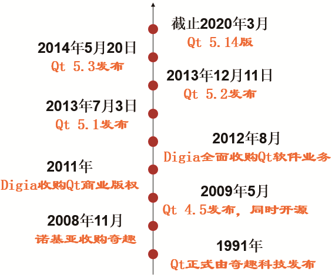
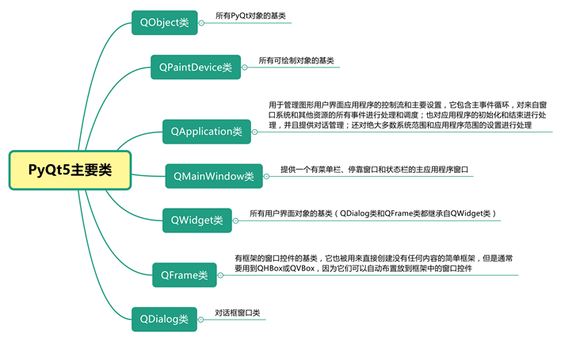
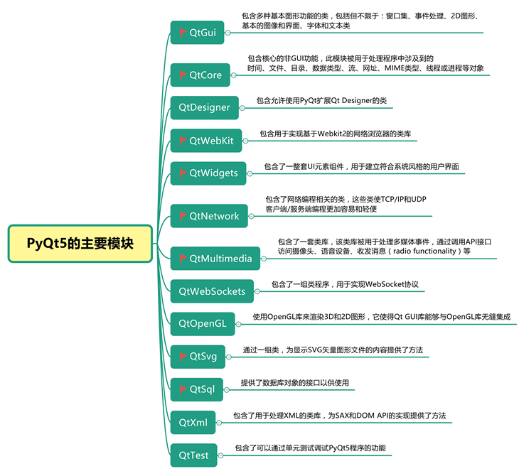

### GUI
- GUI，又被称为图形用户接口或者图形用户界面，它是Graphical User Interface的简称，表示采用图形方式显示的计算机操作用户界面。
- GUI是一种人与计算机通信的界面显示格式，允许用户使用鼠标等输入设备对计算 机进行操作。比如Windows操作系统就是一种最常见的GUI程序，另外，平时使用的QQ软件、处理软件Excel表格、处理图片用的美图秀秀、观看视频时使用的优酷等视频播放软件等，都属于GUI程序

### PyQt5

- 对Qt库进行完全封装。
- 使用信号/槽机制进行通信。
-  提供了一整套进行GUI程序开发的窗口控件。
- 本身拥有超过620个类和近6000个函数及方法。
- 可以跨平台运行在所有主要的操作系统上，包括UNIX、Windows和Mac OS等。
-  支持使用Qt的可视化设计器进行图形界面设计，并能够自动生成Python代码。

**说明：**

1）PyQt5不向下兼容PyQt4，而且官方默认只提供对Python 3.x的支持，如果在Python 2.x上使用PyQt5，需要自行编译，因此建议大家使用Python 3.x+PyQt5开发GUI程序。

2）PyQt5采用双许可协议，即GPL和商业许可，自由开发者可以选择使用免费的GPL协议版本；而如果准备将PyQt5用于商业，则必须为此交付商业许可费用。

GPL协议是GNU General Public License的缩写，它是GNU通用公共授权非正式的中文翻译。使用GPL协议，表示软件版权属于开发者本人，软件产品受国际相关版权法的保护，允许其他用户对原作者的软件进行复制或发行，并且可以在更改之后发行自己的软件，但新软件在发布时也必须遵守GPL协议，不可以对其进行其他附加限制。这里需要说明的一点是，使用GPL协议的软件，不能申请软件产品专利，因此也就不存在“盗版”的说法。

PyQt（官网：https://www.riverbankcomputing.com/）则是将Python与Qt融为一体，也就是说，PyQt允许使用Python语言调用Qt库中的API，这样做的最大好处就是在保留了Qt高运行效率的同时，且大大提高了开发效率。因为，相对于C++语言来说，Python语言的代码量、开发效率都要更高，而且其语法简单、易学。并且，PyQt对Qt做了完整的封装，几乎可以使用PyQt做Qt能做的任何事情。

由于目前最新的PyQt版本是5.14，所以习惯上称PyQt为PyQt5。

综上所述，我们可以看出，PyQt就是使用Python对Qt进行了封装，而PyQt5则是PyQt的一个版本，它们的关系如图6所示。

### 主要类别

1. 图8中提到QtSvg模块主要提供了可用于显示SVG矢量图形文件的类，那么什么是SVG文件呢？SVG是一种可缩放的矢量图形，它的英文全称为Scalable Vector Graphics，是一种用于描述二维图形和图形应用程序的XML语言。SVG图像非常适合于设计高分辨率的Web图形页面，用户可以直接用代码来描绘图像，也可以用任何文字处理工具打开SVG图像，并且可以通过改变部分代码来使得图像具有交互功能，并能够随时插入到HTML中并通过浏览器来观看。

2. PyQt5的官方帮助地址：https://www.riverbankcomputing.com/static/Docs/PyQt5/，该帮助是官方提供的在线英语帮助说明，读者可以根据自身需求进行查看。

### 其他常用GUI开发库

（1）tkinter

tkinter又称作“Tk接口”，是一个轻量级的跨平台图形用户界面（GUI）开发工具，是Tk图形用户界面工具包标准的Python接口，可以运行在大多数Unix、Windows和Mac OS系统中，而且tkinter是安装Python解释器时自动安装的组件，Python的默认IDLE就是使用tkinter开发的。

（2）Flexx

Flexx是用于创建图形用户界面（GUI）的纯Python工具箱，该工具箱使用Web技术进行渲染。作为跨平台的Python工具，用户可以使用Flexx创建桌面应用程序和Web应用程序，同时可以将程序导出到独立的HTML文档中。

作为GitHub推荐的纯Python图形界面开发工具，它的诞生基于网络，且已经成为向用户提供应用程序及交互式科学内容时一个越来越流行的方法。

（3）wxPython

wxPython是Python语言的一套优秀的GUI图形库，可以帮助开发人员轻松创建功能强悍的图形用户界面的程序。同时wxPython作为优秀的跨平台GUI库wxWidgets的Python封装，它具有非常优秀的跨平台能力，可以在不修改程序的情况下在多种平台上运行，支持Windows、Mac OS及大多数的Unix系统。

（4）Kivy

Kivy是一款用于跨平台、快速应用开发的开源框架，只需编写一套代码便可轻松运行于各大移动平台和桌面上，例如Android、iOS、Linux、Mac OS和Windows等。

（5）PySide

PySide是跨平台的应用程序框架Qt的Python绑定版本，可以使用Python语言和Qt进行界面开发。在2009年8月，PySide首次发布，提供和PyQt类似的功能，并兼容API。但与PyQt不同的是，它使用LGPL授权，允许进行免费的开源软件和私有的商业软件的开发；另外，相对于PyQt，它支持的Qt版本比较老，最高版本只支持到Qt 4.8版本，而且官方已经停止维护该库。

（6）PyGTK

PyGTK是Python对GTK+GUI库的一系列封装，它最常用于GNOME平台上，虽然也支持Windows系统，但表现不太友好。所以，如果在Windows系统上开发Python的GUI程序，不建议读者朋友使用该库。