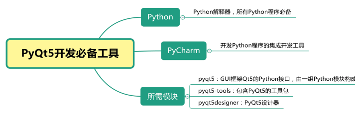
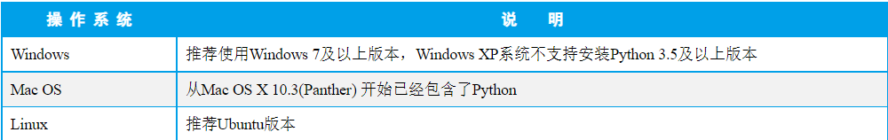
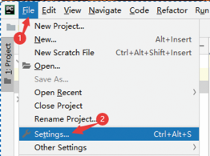
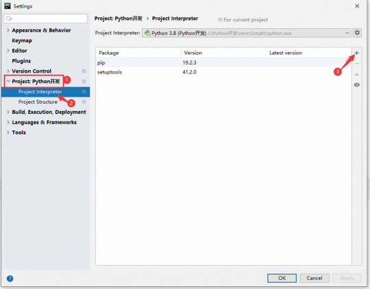
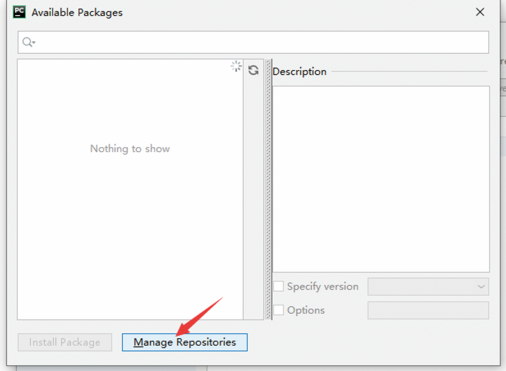
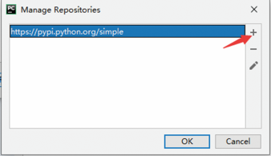
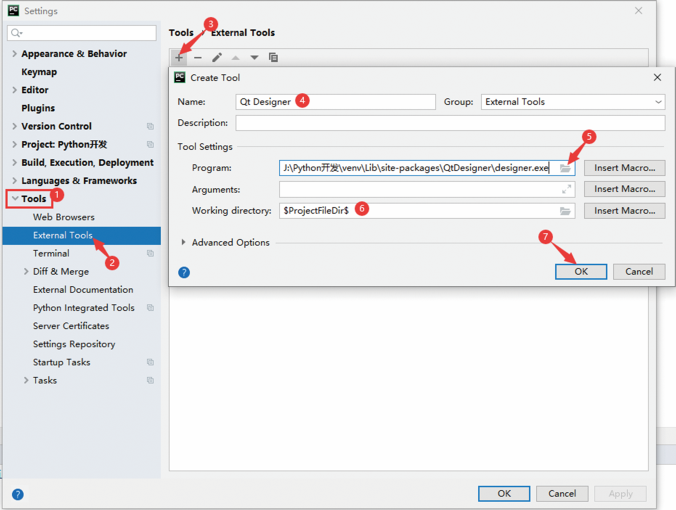

### 开发工具

Python是跨平台的开发工具，它可以在多个操作系统上进行使用，编写好的程序也可以在不同系统上运行。进行Python开发常用的操作系统及说明如表1所示。

### 在PyCharm中配置PyQt5环境

1 安装PyQt5及设计器

在PyCharm中安装PyQt5及设计器的具体步骤如下：

1）在PyCharm开发工具的主窗口中，依次选择File→Settings菜单项，如图1所示。

2）打开PyCharm的设置窗口，展开Project节点，单击Project Interpreter选项，单击窗口最右侧的“+”按钮，如图2所示。

3）弹出“Available Packages”窗口，如图3所示，该窗口中主要列出所有可用的Python模块，但我们发现，图3中并没有可用的Python模块，这是为什么呢？这主要是由于默认的可用Python模块都是从Python的官网加载而来的，而Python官网由于是一个国外的网站，访问速度比较慢，所以这里就会加载得很慢，因此建议增加国内提供的可用镜像站点，单击Manage Repositories按钮。

4）在弹出的“Manage Repositories”窗口中，单击右侧“+”按钮，如图4所示，弹出“Repository URL”窗口，在该窗口的文本框中输入一个国内的Python模块镜像地址，比如，这里输入了清华大学提供的镜像地址：https://pypi.tuna.tsinghua.edu.cn/simple，如图5所示，然后依次单击OK按钮，返回“Available Packages”窗口。

**配置**PyQt5设计器及转换工具

由于使用PyQt5创建GUI图形用户界面程序时，会生成扩展名为.ui的文件，该文件需要转换为.py文件后才可以被Python识别，所以需要为PyQt5与PyCharm开发工具进行配置。

接下来配置PyQt5的设计器，及将.ui文件（使用PyQt5设计器设计的文件）转换为.py文件（Python脚本文件）的工具，具体步骤如下：

1）在PyCharm开发工具的设置窗中依次单击Tools→External Tools选项，然后在右侧单击“+”按钮，弹出“Create Tool”窗口，在该窗口，首先在“Name”文本框中填写工具名称为Qt Designer，然后单击“Program”后面的文件夹图标，选择安装pyqt5designer模块时自动安装的designer.exe文件，该文件位于当前虚拟环境的“Lib\site-packages\QtDesigner\”文件夹中，最后在“Working directory”文本框中输入“$ProjectFileDir$”，表示项目文件目录，最后单击OK按钮，如图10所示。

