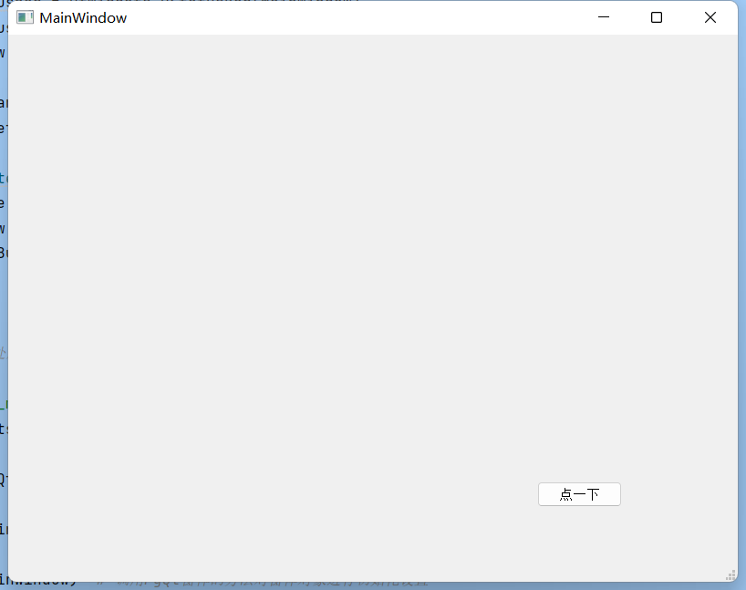

W## 使用Qt Designer创建窗口

```python
# -*- coding: utf-8 -*-

# Form implementation generated from reading ui file 'test.ui'
#
# Created by: PyQt5 UI code generator 5.15.6
#
# WARNING: Any manual changes made to this file will be lost when pyuic5 is
# run again.  Do not edit this file unless you know what you are doing.


from PyQt5 import QtCore, QtGui, QtWidgets


class Ui_MainWindow(object):
    def setupUi(self, MainWindow):
        MainWindow.setObjectName("MainWindow")
        MainWindow.resize(800, 600)
        self.centralwidget = QtWidgets.QWidget(MainWindow)
        self.centralwidget.setObjectName("centralwidget")
        self.pushButton = QtWidgets.QPushButton(self.centralwidget)
        self.pushButton.setGeometry(QtCore.QRect(580, 490, 93, 28))
        self.pushButton.setObjectName("pushButton")
        MainWindow.setCentralWidget(self.centralwidget)
        self.menubar = QtWidgets.QMenuBar(MainWindow)
        self.menubar.setGeometry(QtCore.QRect(0, 0, 800, 26))
        self.menubar.setObjectName("menubar")
        MainWindow.setMenuBar(self.menubar)
        self.statusbar = QtWidgets.QStatusBar(MainWindow)
        self.statusbar.setObjectName("statusbar")
        MainWindow.setStatusBar(self.statusbar)

        self.retranslateUi(MainWindow)
        QtCore.QMetaObject.connectSlotsByName(MainWindow)

    def retranslateUi(self, MainWindow):
        _translate = QtCore.QCoreApplication.translate
        MainWindow.setWindowTitle(_translate("MainWindow", "MainWindow"))
        self.pushButton.setText(_translate("MainWindow", "点一下"))

import sys

# 程序入口，程序从此处启动PyQt设计的窗体

if __name__ == '__main__':
    app = QtWidgets.QApplication(sys.argv)

    MainWindow = QtWidgets.QMainWindow()  # 创建窗体对象

    ui = Ui_MainWindow()  # 创建PyQt设计的窗体对象

    ui.setupUi(MainWindow)  # 调用PyQt窗体的方法对窗体对象进行初始化设置

    MainWindow.show()  # 显示窗体

    sys.exit(app.exec_())  # 程序关闭时退出进程
```

