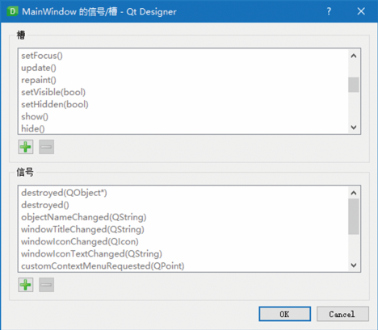

###  **信号与槽的基本概念**

信号（signal）与槽（slot）是Qt的核心机制，也是进行PyQt5编程时对象之间通信的基础。在PyQt5中，每一个QObject对象（包括各种窗口和控件）都支持信号与槽机制，通过信号与槽的关联，就可以实现对象之间的通信。当信号发射时，连接的槽函数（方法）将会自动执行。在PyQt5中，信号与槽是通过对象的signal.connect()方法进行连接的。

PyQt5的窗口控件中有很多内置的信号，例如，图所示为MainWindow主窗口的部分内置信号与槽。



PyQt5中使用信号与槽的主要特点如下：

一个信号可以连接多个槽。

- 一个槽可以监听多个信号。

- 信号与信号之间可以互连。

- 信号与槽的连接可以跨线程。

- 信号与槽的连接方式即可以是同步，也可以是异步。
- 信号的参数可以是任何的Python类型。

信号与槽的连接工作示意过程如图2所示。


### **编辑信号与槽**

例如，通过信号（signal）与槽（slot）实现一个单击按钮关闭主窗口的运行效果，具体操作步骤如下：

1）打开Qt Designer设计器，从左侧的工具箱中向窗口中添加一个PushButton按钮，并设置按钮的text属性为“关闭”，如图3所示。

```python
    # 信号与槽
        self.pushButton.clicked.connect(MainWindow.close)
```

### 自定义槽

在前面的内容中，介绍了如何将控件的信号与PyQt5内置的槽函数相关联，除此之外，用户还可以自定义槽，自定义槽本质上就是自定义一个函数，该函数来实现相应的功能。

### 将自定义槽连接到信号

```python
self.pushButton.clicked.connect(self.showMessage)
```

